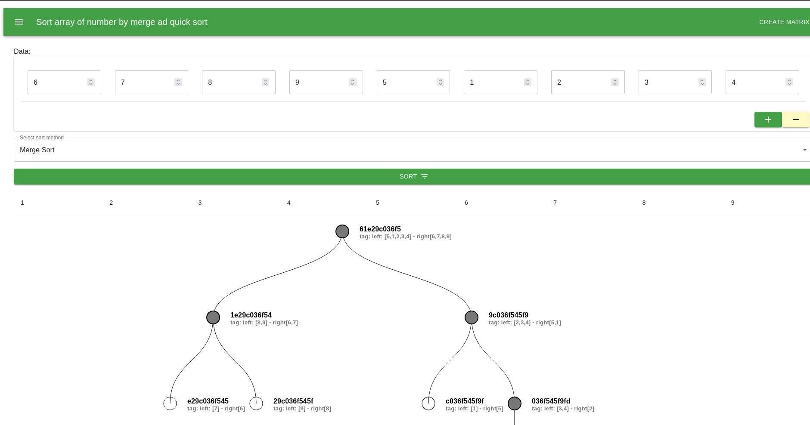

# Programa para calcular el ordenamiento mediante Quicksort y Mergesort, además de obtener su árbol de ejecución (Español)

## Introducción

Este programa ordena una lista de datos utilizando el algoritmo Quicksort o Mergesort, mostrando su árbol de ejecución.

## Quicksort 

Quicksort es un algoritmo de clasificación ampliamente utilizado que sigue el enfoque de divide y vencerás. Fue desarrollado por Tony Hoare en 1959 y es conocido por su eficiencia y desempeño promedio. Quicksort funciona dividiendo una matriz en dos subarreglos, ordenando recursivamente cada subarreglo y luego combinando los subarreglos ordenados para obtener el resultado ordenado final.

1. Elija un elemento pivote de la matriz. El pivote puede ser cualquier elemento, pero es común seleccionar el último elemento como pivote.

2. Divida la matriz reorganizando sus elementos de modo que todos los elementos más pequeños que el pivote se coloquen antes del pivote y todos los elementos más grandes que el pivote se coloquen después del pivote. El elemento pivote debería estar ahora en su posición ordenada final.

3. Aplique recursivamente los pasos 1 y 2 al subarreglo antes del pivote (es decir, los elementos más pequeños que el pivote) y al subarreglo después del pivote (es decir, los elementos más grandes que el pivote).

4. Continúe con este proceso hasta que se ordene toda la matriz. El caso base para la recursividad es cuando un subarreglo tiene menos de dos elementos, ya que se considera ordenado.

## Ejemplo del árbol de ejecucción

## Mergesort

Merge sort es un algoritmo de clasificación popular que sigue el enfoque de divide y vencerás. Fue inventado por John von Neumann en 1945. La ordenación por combinación divide la lista sin ordenar en sublistas más pequeñas, ordena esas sublistas de forma recursiva y luego las vuelve a fusionar para producir una lista ordenada.

1. Divida la lista desordenada en dos mitades, aproximadamente del mismo tamaño.

2. Ordene recursivamente cada mitad aplicando el algoritmo de ordenación por fusión.

3. Vuelva a fusionar las dos sublistas ordenadas para obtener una única lista ordenada.

## Ejemplo del árbol de ejecucción

## Acerca del autor 
Estuandite de Doctorado: Juan Carlos Moreno Sanchez

<carlos.moreno.phd@gmail.com>

<jcmorenos001@alumno.uaemex.mx>

# Program to calculate the ordering using Quicksort and Mergesort, in addition to obtaining its execution tree (English)

## Introduction
This program sorts a list of data using the Quicksort or Mergesort algorithm, displaying its execution tree.

## Quicksort 

Quicksort is a widely used sorting algorithm that follows the divide-and-conquer approach. It was developed by Tony Hoare in 1959 and is known for its efficiency and average-case performance. Quicksort works by partitioning an array into two subarrays, recursively sorting each subarray, and then combining the sorted subarrays to obtain the final sorted result.

1. Choose a pivot element from the array. The pivot can be any element, but it's common to select the last element as the pivot.

2. Partition the array by rearranging its elements so that all elements smaller than the pivot are placed before the pivot, and all elements greater than the pivot are placed after the pivot. The pivot element should now be in its final sorted position.

3. Recursively apply steps 1 and 2 to the subarray before the pivot (i.e., the elements smaller than the pivot) and the subarray after the pivot (i.e., the elements greater than the pivot).

4. Continue this process until the entire array is sorted. The base case for the recursion is when a subarray has fewer than two elements, as it is already considered sorted.

## Execution Tree Example

## Mergesort

Merge sort is a popular sorting algorithm that follows the divide-and-conquer approach. It was invented by John von Neumann in 1945. Merge sort divides the unsorted list into smaller sublists, sorts those sublists recursively, and then merges them back together to produce a sorted list.

1. Divide the unsorted list into two halves, roughly equal in size.

2. Recursively sort each half by applying the merge sort algorithm.

3. Merge the two sorted sublists back together to obtain a single sorted list.

## Execution Tree Example

## About the author
Student of PhD: Juan Carlos Moreno Sanchez

<carlos.moreno.phd@gmail.com>

<jcmorenos001@alumno.uaemex.mx>