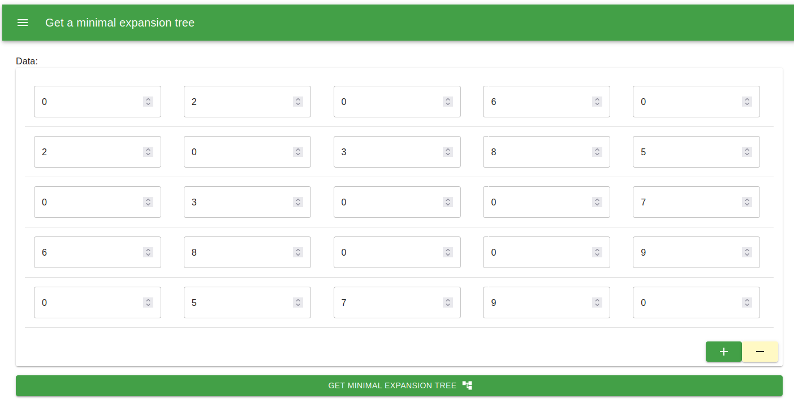
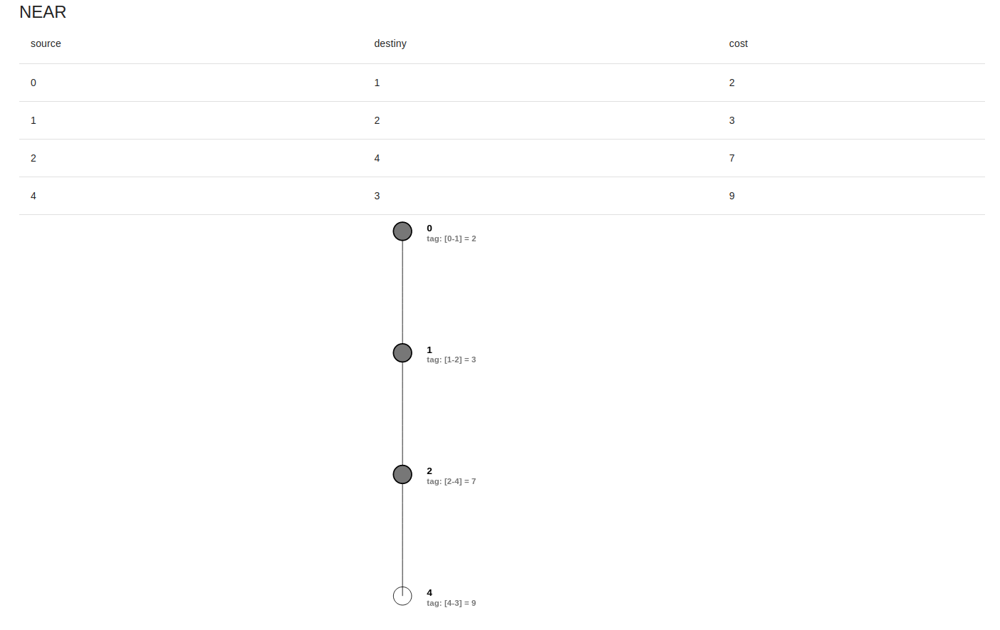

# Programa para obtener el árbol de expansion minima y la matriz NEAR (Español)

## Introducción

Un algoritmo codicioso es un paradigma algorítmico que sigue la heurística de resolución de problemas de hacer la elección óptima localmente en cada etapa con la esperanza de encontrar un óptimo global. En otras palabras, hace la mejor elección posible en cada paso sin considerar las consecuencias generales ni examinar todas las soluciones posibles.

La principal característica de un algoritmo voraz es que realiza una serie de elecciones que son óptimas en el momento, sin reconsiderarlas después. Al seleccionar la solución óptima localmente en cada paso, el algoritmo tiene como objetivo alcanzar la mejor solución posible para todo el problema.

## Prim 
El algoritmo de Prim es un algoritmo codicioso que se utiliza para encontrar un árbol de expansión mínimo (MST) en un gráfico no dirigido ponderado. Un árbol de expansión mínimo es un árbol que conecta todos los vértices del gráfico con el peso total mínimo.

El algoritmo comienza con un vértice arbitrario y luego hace crecer el MST agregando el borde con el peso más pequeño que conecta un vértice en el MST con un vértice fuera del MST. Este proceso continúa hasta que todos los vértices están incluidos en el MST.

La complejidad temporal del algoritmo de Prim es $O(V^2)$ u $O(E \log V)$ según la implementación, donde V es el número de vértices y E es el número de aristas en el gráfico.

## Ejecución

## Acerca del autor 
Estuandite de Doctorado: Juan Carlos Moreno Sanchez

<carlos.moreno.phd@gmail.com>

<jcmorenos001@alumno.uaemex.mx>

# Program to obtain the minimum spanning tree and the NEAR matrix (English)

## Introduction
A greedy algorithm is an algorithmic paradigm that follows the problem-solving heuristic of making the locally optimal choice at each stage in the hope of finding a global optimum. In other words, it makes the best possible choice at each step without considering the overall consequences or examining all possible solutions.

The main characteristic of a greedy algorithm is that it makes a series of choices that are optimal at the moment, without reconsidering them later. By selecting the locally optimal solution at each step, the algorithm aims to reach the best possible solution for the entire problem.

## Prim

The Prim's algorithm is a greedy algorithm that is used to find a minimum spanning tree (MST) in a weighted undirected graph. A minimum spanning tree is a tree that connects all the vertices of the graph with the minimum total weight.

The algorithm starts with an arbitrary vertex and then grows the MST by adding the edge with the smallest weight that connects a vertex in the MST to a vertex outside the MST. This process continues until all the vertices are included in the MST.

The time complexity of Prim's algorithm is $O(V^2)$ or $O({E}\log V)$ depending on the implementation, where V is the number of vertices and E is the number of edges in the graph.

## Execution

## About the author
Student of PhD: Juan Carlos Moreno Sanchez

<carlos.moreno.phd@gmail.com>

<jcmorenos001@alumno.uaemex.mx>